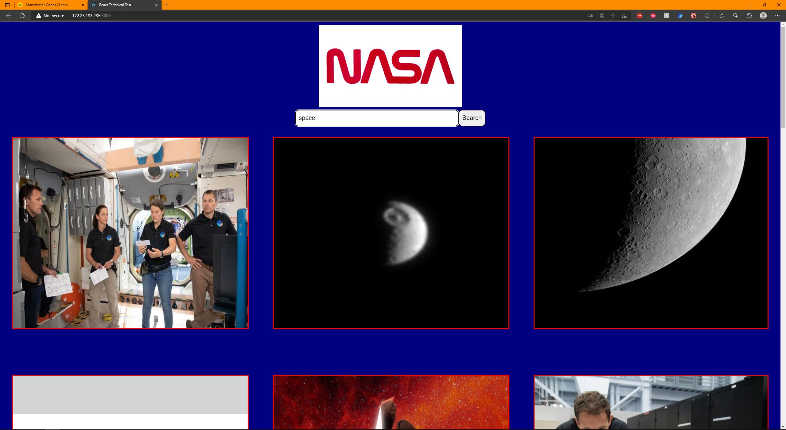

# NASA Space Search - React Developer Technical Task

## Task

I'm expected to build a React web application that allows users to search for images based on a query relating to space. I've been provided the NASA API endpoint for image search.
They want me to consider and add anything to my repository that should be included was this to be a live website.

The following functionalities need to be implemented:
● A Search page which allows users to search for images by keyword
● Images must be returned upon a successful search

The styling is up to me but will be taken into consideration when evaluating your application.

They estimate this task to take ​​10 hours​​. Once I have completed the task upload the repository to GitHub and send the link to xxxxx@xxx.com. ​Deadline: 5 days from receiving.

Relevant API endpoints:

image search:
GET​​ ​​https://images-api.nasa.gov/search ​Params: ​​q

### Assets

I may use this asset for my application: https://cdn.cnn.com/cnnnext/dam/assets/200424060716-nasa-worm-logo.jpg

## Screenshots

### Desktop

### Mobile

## Technologies Used

### Language

- React (using `create-react-app`)

### Testing Utilities

- Jest
- React Testing Library

### Packages

- Axios
- PropTypes

## Instructions

- Clone this repo and `cd` into it in your IDE
- Run `npm install`
- Run `npm start`

## If I had more time

- Fix the search bar in place, so you don't need to scroll back up to make a new search
- Amend the logo in photoshop to remove the white space
- Test the getImages function with mock data.

## Author

- Will Hodgkinson
